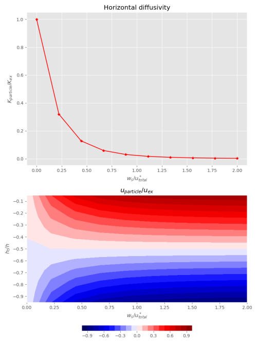

# NearshoreParticleTransport
Code for nearshore particle dispersal statistics from Moulton et al. Mechanisms for the exchange of nutrients, plankton, and pollutants across the nearshore region. Annual Review of Marine Science, Volume 15, Januray 2023. All nomenclature here and and in the code is explained in this paper. 

## Nearshore_Mixing_and_Uex_vrs_ws.py 
This code estimates the magnitude of the horizontal exchange diffusivity as a function of the velocity profile, water depth, swimming behavior and the strength of the exchange velocity. It produces two plots, one showning the horizontal diffusivity K_particle as a function of the swimming speed and the second showing the exchange velocity u_particle as a funtion of the swimming speed w_s and the turbulent velocity scale u*. 

