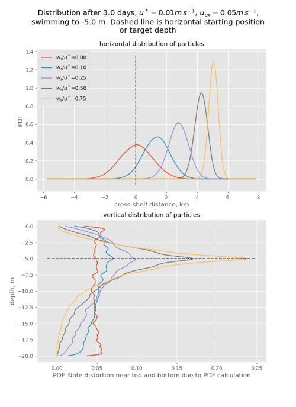

# NearshoreParticleTransport
Code for nearshore particle dispersal statistics from Moulton et al. Mechanisms for the exchange of nutrients, plankton, and pollutants across the nearshore region. Annual Review of Marine Science, Volume 15, Januray 2023. All nomenclature here and and in the code is explained in this paper. 

## Nearshore_Mixing_and_Uex_vrs_ws.py 
This code estimates the magnitude of the horizontal exchange diffusivity as a function of the velocity profile, water depth, swimming behavior and the strength of the exchange velocity. It produces two plots, the first showning the horizontal diffusivity K_particle as a function of the swimming speed and the second showing the exchange velocity u_particle as a funtion of the swimming speed w_s and the turbulent velocity scale u*: 

The second figure shows the cross-shelf and vertical distribution of the particles as a function of depth keeping behavior:

## Nearshore_crossShelfTransportAnimation.py 
This code animates an ensemble of particles in the same model as Nearshore_Mixing_and_Uex_vrs_ws.py. If you want to adapt the model to your particular environment, I strongly suggest playing with the Nearshore_crossShelfTransportAnimation.py code to get an idea of what the particles are doing, and then transfer the code to the longer-running and more opaque Nearshore_Mixing_and_Uex_vrs_ws.py code.
